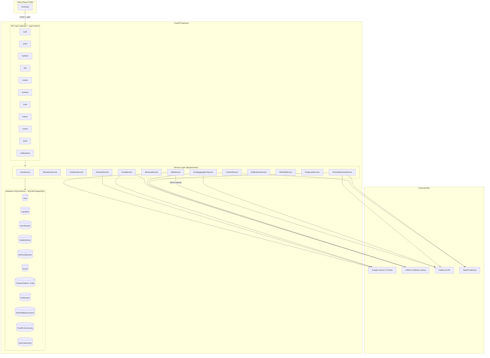
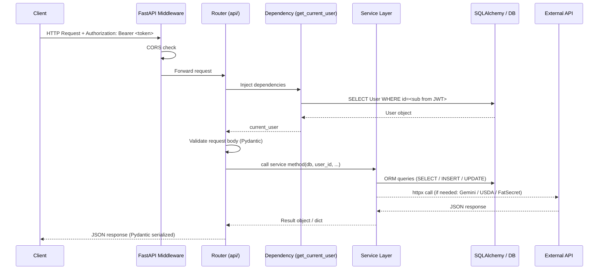
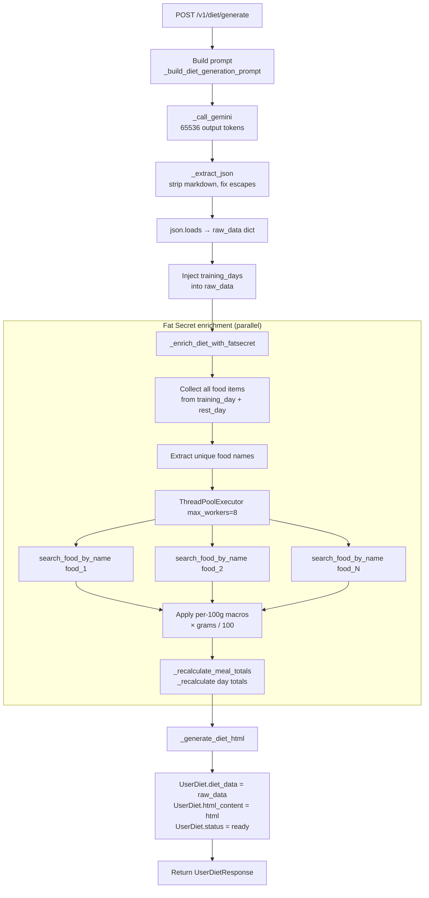
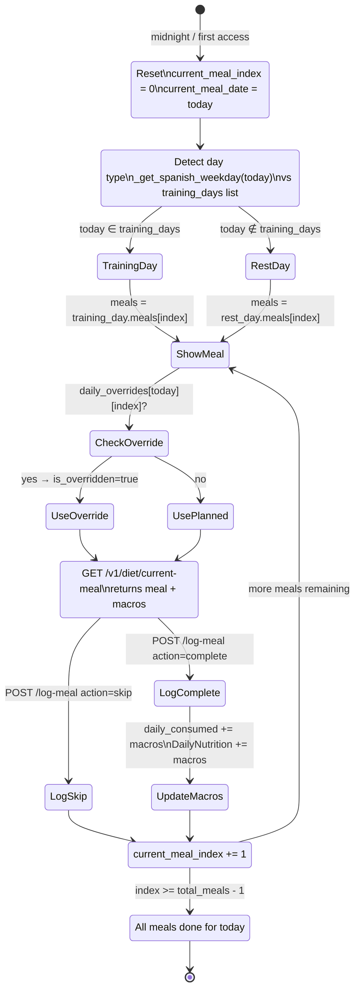
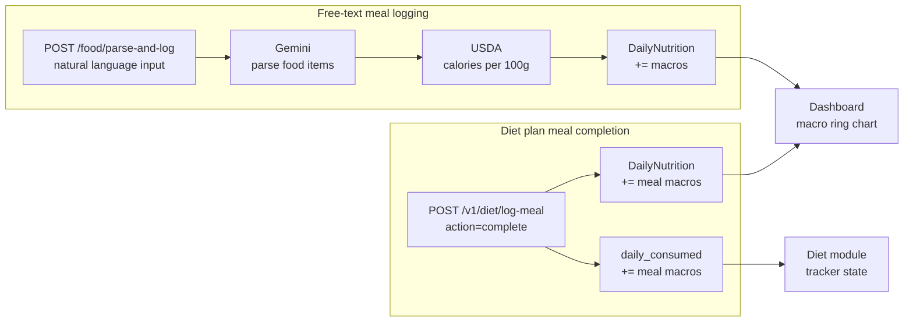
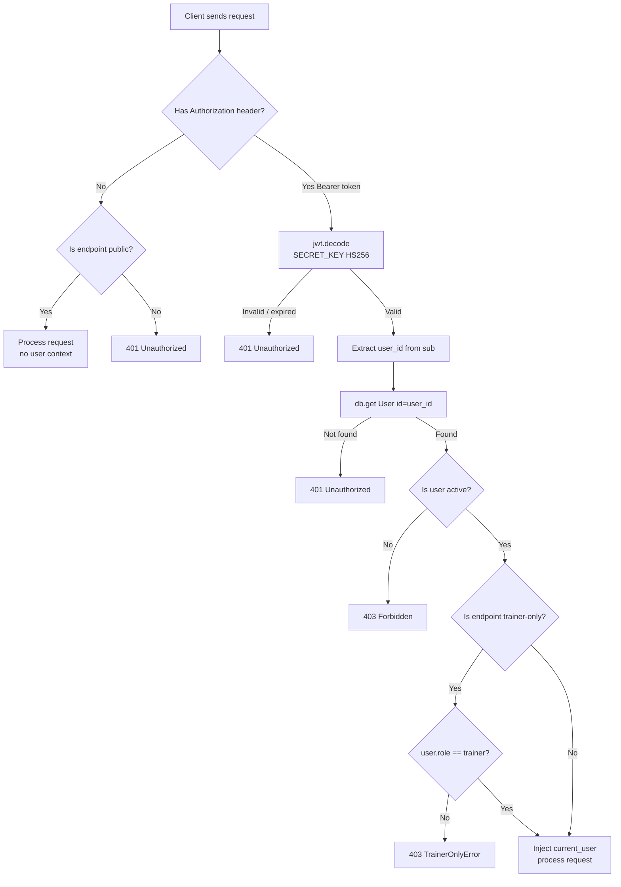
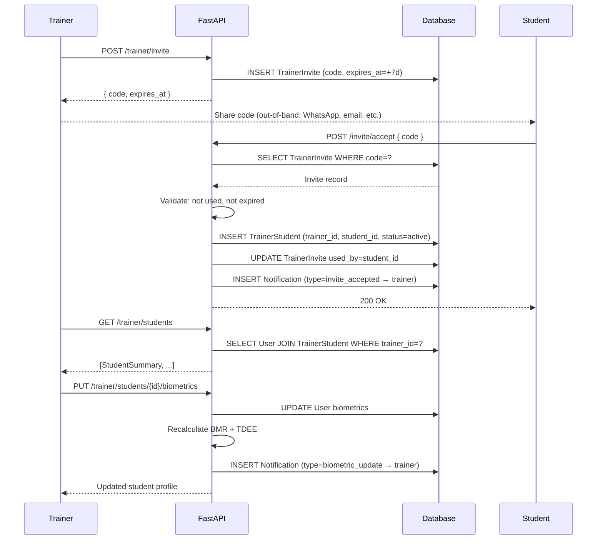
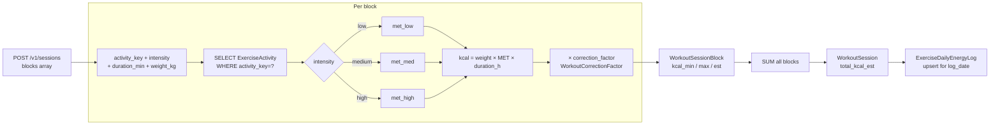
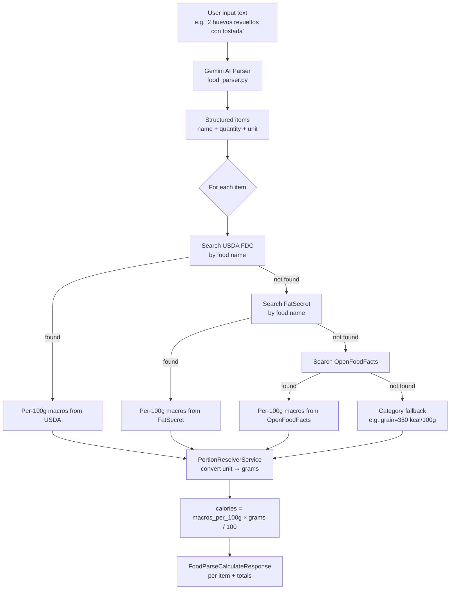

# NovaFitness — Backend Connection Diagram

All diagrams use [Mermaid](https://mermaid.js.org/) syntax.
Render with: GitHub, VS Code extension "Markdown Preview Mermaid Support", or mermaid.live.

---

## 1. High-level component map

---

## 2. Request lifecycle

---

## 3. Diet plan generation flow

---

## 4. Meal tracker daily flow

---

## 5. Nutrition tracking — two systems

---

## 6. Authentication and authorization

---

## 7. Trainer–student relationship

---

## 8. Workout calorie estimation

---

## 9. Food macro resolution pipeline

